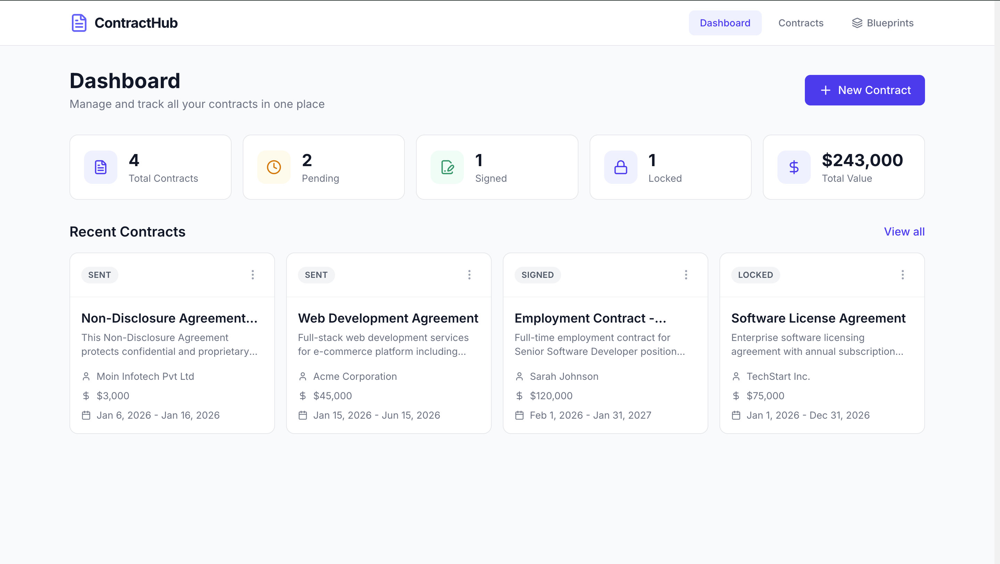
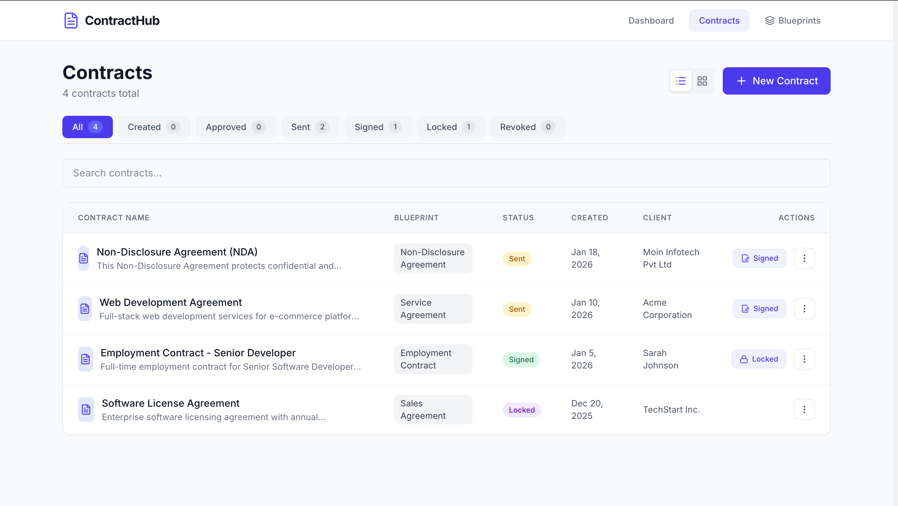
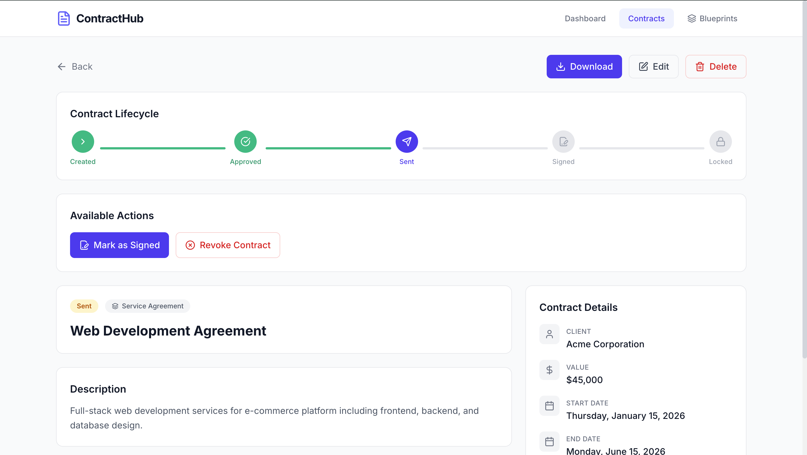
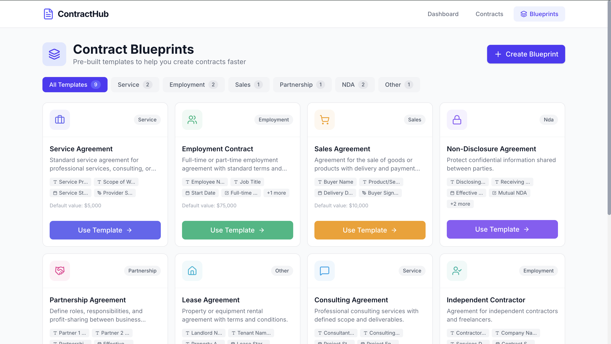
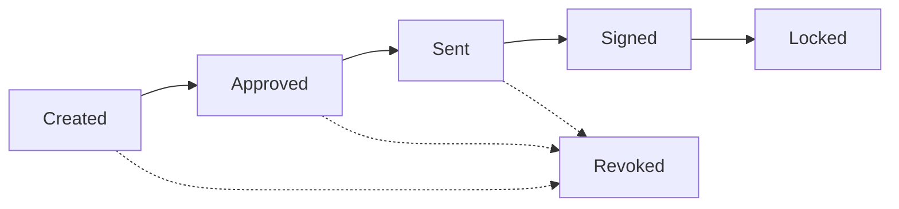

# 📄 Contract Hub

> **Smart Contract Management Platform** - Streamline your contract lifecycle from creation to completion.

A modern, full-featured contract management system built with React, TypeScript, and Redux. Manage contracts through their entire lifecycle, create custom blueprints, and download professional PDF documents—all in one elegant interface.

## 🌐 Live Demo

**<a href="https://contract.moinmalek6612.workers.dev/" target="_blank">🚀 View Live Application</a>**

🔗 <a href="https://contract.moinmalek6612.workers.dev/" target="_blank">https://contract.moinmalek6612.workers.dev/</a>

Try out the platform with pre-loaded demo contracts and explore all features without any setup!

---

## ✨ Why Contract Hub?

Contract Hub was built to solve the common pain points of managing business contracts:

- **Fragmented Workflows** - Multiple tools for creating, tracking, and storing contracts
- **No Status Visibility** - Unclear contract states and approval stages
- **Repetitive Work** - Creating similar contracts from scratch every time
- **Poor Organization** - Contracts scattered across emails and folders

This platform brings everything together in one place with a clean, intuitive interface that makes contract management actually enjoyable.

---

## 📹 Demo


*Dashboard with contract overview and quick stats*


*Contract page with All necessary details*


*Contract detail page with lifecycle tracking*


*Customizable contract blueprints*

---

## 🚀 Features

### Contract Lifecycle Management
- **5-Stage Workflow**: Created → Approved → Sent → Signed → Locked
- **Status Tracking**: Real-time visibility of contract states
- **Revoke Option**: Cancel contracts at any stage
- **Bulk Actions**: Quick status changes and batch operations

### Blueprint System
- **Pre-built Templates**: Service, Employment, Sales, Partnership, NDA, and more
- **Custom Blueprints**: Create your own templates from scratch
- **Dynamic Fields**: Add Text, Date, Signature, and Checkbox fields
- **Field Editor**: Rename, reorder, and configure custom fields

### Smart Features
- **Search & Filter**: Find contracts instantly by name, client, or status
- **Table/Grid Views**: Switch between list and card layouts
- **PDF Export**: Download professional contract documents
- **Responsive Design**: Works perfectly on desktop, tablet, and mobile
- **Demo Data**: Pre-loaded sample contracts to explore features

### Data Persistence
- **LocalStorage**: All data saved locally in your browser
- **Import/Export**: Backup and restore your contracts (coming soon)

---

## 🛠️ Technologies Used

### Frontend
- **React 19** - UI library with latest features
- **TypeScript** - Type-safe development
- **Vite** - Lightning-fast build tool
- **Tailwind CSS v4** - Utility-first styling

### State Management
- **Redux Toolkit** - Predictable state container
- **React Redux** - Official React bindings

### Routing & Navigation
- **React Router** - Client-side routing

### UI & Icons
- **Lucide React** - Beautiful icon library
- **jsPDF** - PDF generation for contract downloads

### Development Tools
- **ESLint** - Code quality and consistency
- **TypeScript Compiler** - Type checking
- **Vite Plugin React** - Fast refresh and HMR

---

## 🏗️ Project Structure

```
contract-hub/
├── src/
│   ├── components/          # Reusable UI components
│   │   ├── BlueprintEditor.tsx
│   │   ├── BlueprintSelector.tsx
│   │   ├── ContractForm.tsx
│   │   ├── ContractCard.tsx
│   │   ├── Header.tsx
│   │   └── ...
│   ├── pages/               # Route pages
│   │   ├── Dashboard.tsx
│   │   ├── ContractList.tsx
│   │   ├── ContractDetail.tsx
│   │   ├── CreateContract.tsx
│   │   ├── EditContract.tsx
│   │   └── Blueprints.tsx
│   ├── store/               # Redux state management
│   │   ├── contractSlice.ts
│   │   ├── blueprintSlice.ts
│   │   ├── hooks.ts
│   │   └── index.ts
│   ├── types/               # TypeScript definitions
│   │   ├── contract.ts
│   │   └── blueprint.ts
│   ├── utils/               # Utility functions
│   │   └── localStorage.ts
│   ├── App.tsx              # Main app component
│   ├── index.css            # Global styles
│   └── main.tsx             # App entry point
├── public/                  # Static assets
├── package.json
├── tsconfig.json
├── vite.config.ts
└── README.md
```

---

## 📋 Prerequisites

Before you begin, ensure you have the following installed:

- **Node.js** (v18 or higher) - [Download here](https://nodejs.org/)
- **npm** (comes with Node.js) or **yarn**
- A modern web browser (Chrome, Firefox, Safari, or Edge)

To check if you have Node.js installed:

```bash
node --version
npm --version
```

---

## 💻 Installation

### 1️⃣ Clone the Repository

```bash
git clone https://github.com/moin1777/contract-hub.git
cd contract-hub
```

### 2️⃣ Install Dependencies

```bash
npm install
```

This will install all required packages including:
- React, Redux, and React Router
- Tailwind CSS and UI dependencies
- TypeScript and development tools

### 3️⃣ Start the Development Server

```bash
npm run dev
```

You should see output like:

```
  VITE v7.3.1  ready in 423 ms

  ➜  Local:   http://localhost:5173/
  ➜  Network: use --host to expose
  ➜  press h + enter to show help
```

### 4️⃣ Open in Browser

Navigate to `http://localhost:5173/` in your browser. You'll see the dashboard with 3 demo contracts pre-loaded!

---

## 📖 Usage

### Creating a Contract

**1. Choose a Blueprint (or Start from Scratch)**

```
Dashboard → New Contract → Select Blueprint
```

You can:
- Pick from 9+ pre-built templates
- Create a custom blueprint with your own fields
- Skip blueprints and build from scratch

**2. Fill in Contract Details**

```typescript
{
  "clientName": "Acme Corporation",
  "title": "Web Development Agreement",
  "description": "Full-stack development services...",
  "value": 45000,
  "startDate": "2026-01-15",
  "endDate": "2026-06-15"
}
```

**3. Add Custom Fields** (if using a blueprint)

Custom fields appear automatically based on your blueprint:
- Text fields for names, roles, descriptions
- Date fields for milestones and deadlines
- Signature fields for authorization
- Checkboxes for yes/no options

**Output**: A new contract is created with status "Created" and appears in your dashboard!

---

### Managing Contract Lifecycle

**Change Status**

```
Contracts List → Three-dots menu → Change Status → Select next stage
```

**Workflow Rules:**
- ✅ Created → Can approve or revoke
- ✅ Approved → Can send or revoke
- ✅ Sent → Can mark as signed or revoke
- ✅ Signed → Can lock (finalize)
- 🔒 Locked → Cannot change (final state)
- ❌ Revoked → Cannot change (canceled)

**Quick Actions:**
- View Details
- Edit Contract (if not locked/revoked)
- Download PDF
- Delete

---

### Creating Custom Blueprints

**1. Navigate to Blueprints**

```
Dashboard → Blueprints → "Start from scratch"
```

**2. Configure Template**

```typescript
{
  "name": "Freelance Agreement",
  "category": "Service",
  "color": "#6366f1",
  "icon": "Briefcase",
  "template": {
    "title": "Freelance Services Agreement",
    "description": "Professional freelance services...",
    "value": 5000
  }
}
```

**3. Add Custom Fields**

Click field type buttons to add:
- 📝 **Text** - Client names, project details
- 📅 **Date** - Deadlines, milestones
- ✍️ **Signature** - Authorization fields
- ☑️ **Checkbox** - Terms acceptance

**4. Save and Use**

Your blueprint appears in the list and can be:
- Used to create new contracts
- Edited to update fields
- Deleted if no longer needed (custom only)

---

### Downloading Contracts

**Generate PDF**

```
Contract Detail Page → Download button
```

**Output**: Professional PDF document with:
- Contract title and client info
- Status badge
- All contract details (dates, value, description)
- Custom fields with values
- Contract ID and timestamps
- Formatted for printing

File downloaded as: `Web_Development_Agreement_contract.pdf`

---

## 🔄 Application Workflow

### 1. **Data Flow Architecture**

```
User Action → Component Event → Redux Action → 
Reducer Updates State → localStorage Sync → UI Re-renders
```

### 2. **Contract Lifecycle**



### 3. **State Management**

**Contracts Slice:**
- Stores all contracts
- Handles CRUD operations
- Manages status transitions
- Persists to localStorage

**Blueprints Slice:**
- Default blueprints (9 templates)
- Custom user blueprints
- CRUD for custom blueprints only
- Field management

### 4. **Routing Structure**

```
/ (Dashboard)
├── /contracts (List View)
│   ├── /contracts/new (Create)
│   ├── /contracts/:id (Detail)
│   └── /contracts/:id/edit (Edit)
└── /blueprints (Blueprint Manager)
```

---

## 🧪 Development

### Available Scripts

```bash
# Start development server with hot reload
npm run dev

# Build for production
npm run build

# Preview production build
npm run preview

# Run ESLint
npm run lint
```

### Building for Production

```bash
npm run build
```

This creates an optimized production build in the `dist/` folder:
- Minified JavaScript and CSS
- Tree-shaken dependencies
- Optimized assets
- Ready to deploy to any static hosting

---

## 📦 Deployment

The app can be deployed to any static hosting service:

### Vercel
```bash
npm install -g vercel
vercel
```

### Netlify
```bash
npm run build
# Drag and drop the dist/ folder to Netlify
```

### GitHub Pages
```bash
npm run build
# Configure GitHub Pages to serve from the dist/ branch
```

---

## 🎨 Customization

### Changing Theme Colors

Edit `tailwind.config.js` to change the primary color:

```js
theme: {
  extend: {
    colors: {
      primary: '#6366f1', // Change this
    }
  }
}
```

### Adding New Blueprint Templates

Edit `src/types/blueprint.ts`:

```typescript
export const defaultBlueprints: Blueprint[] = [
  // Add your blueprint here
  {
    id: 'bp-custom',
    name: 'Your Template',
    // ... rest of config
  }
];
```

---

## 🐛 Troubleshooting

### Development server won't start
- Check if port 5173 is available
- Try `npm install` again to reinstall dependencies
- Clear `node_modules` and reinstall: `rm -rf node_modules && npm install`

### Data not persisting
- Check browser console for localStorage errors
- Ensure you're not in incognito/private mode
- Check browser settings for localStorage permissions

### PDF download not working
- Ensure jsPDF is installed: `npm install jspdf`
- Check browser console for errors
- Try a different browser

---

## 🤝 Contributing

Contributions are welcome! Please feel free to submit a Pull Request.

1. Fork the repository
2. Create your feature branch (`git checkout -b feature/AmazingFeature`)
3. Commit your changes (`git commit -m 'Add some AmazingFeature'`)
4. Push to the branch (`git push origin feature/AmazingFeature`)
5. Open a Pull Request

---

## 📄 License

This project is licensed under the **MIT License** - see the [LICENSE](LICENSE) file for details.

### What this means:
✅ Commercial use  
✅ Modification  
✅ Distribution  
✅ Private use  

⚠️ Liability and warranty are not provided

---

## 🎯 Roadmap

Future enhancements planned:

- [ ] **Cloud Sync** - Save contracts across devices
- [ ] **Email Integration** - Send contracts directly to clients
- [ ] **E-Signatures** - Built-in digital signature support
- [ ] **Template Marketplace** - Share and download blueprints
- [ ] **Analytics Dashboard** - Contract insights and metrics
- [ ] **Multi-user Support** - Team collaboration features
- [ ] **Version History** - Track contract changes over time
- [ ] **Notifications** - Alerts for contract milestones
- [ ] **Dark Mode** - Eye-friendly theme option
- [ ] **Export/Import** - Backup contracts as JSON

---

## 💡 Fun Facts

- 🚀 Built in **React 19** with the latest features
- 🎨 Uses **Tailwind CSS v4** (bleeding edge!)
- 📦 Zero database required - pure frontend magic
- ⚡ Lightning-fast with Vite's HMR
- 🎯 100% TypeScript for type safety
- 📱 Fully responsive - works on any device

---

## 📞 Support

Having issues? Found a bug? Have a feature request?

- 📧 Email: malekmoin.work@gmail.com
- 🐛 Issues: [GitHub Issues](https://github.com/moin1777/contract-hub/issues)
- 💬 Discussions: [GitHub Discussions](https://github.com/moin1777/contract-hub/discussions)

---

## 🙏 Acknowledgments

- **Icons** by [Lucide](https://lucide.dev/)
- **Styling** with [Tailwind CSS](https://tailwindcss.com/)
- **State Management** by [Redux Toolkit](https://redux-toolkit.js.org/)
- **PDF Generation** via [jsPDF](https://github.com/parallax/jsPDF)

---

<div align="center">

**⭐ Star this repo if you find it helpful!**

Made with ❤️ and ☕

*"Simplifying contracts, one click at a time."*

</div>